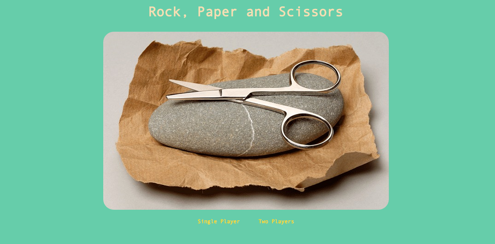
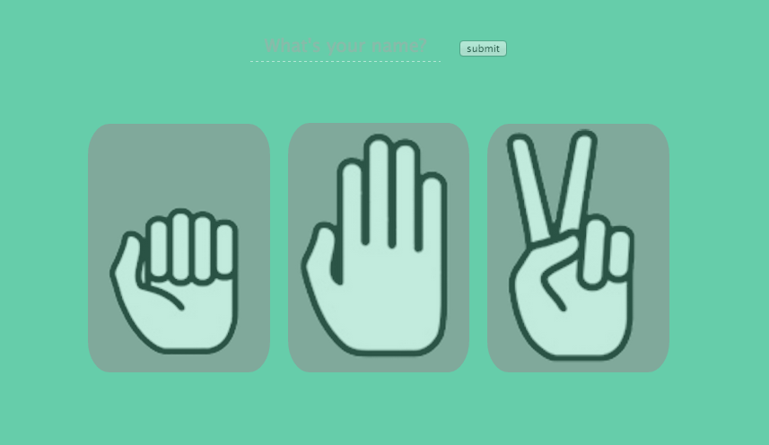
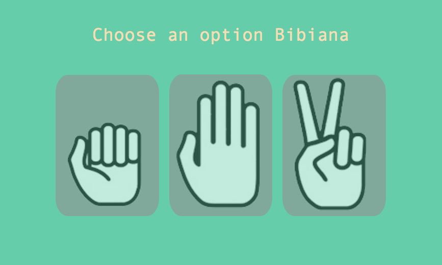
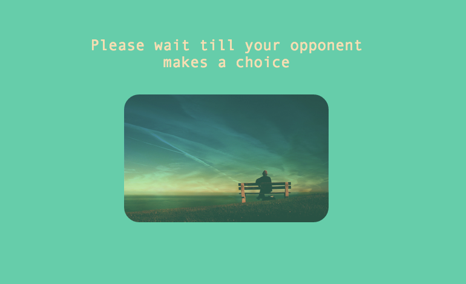
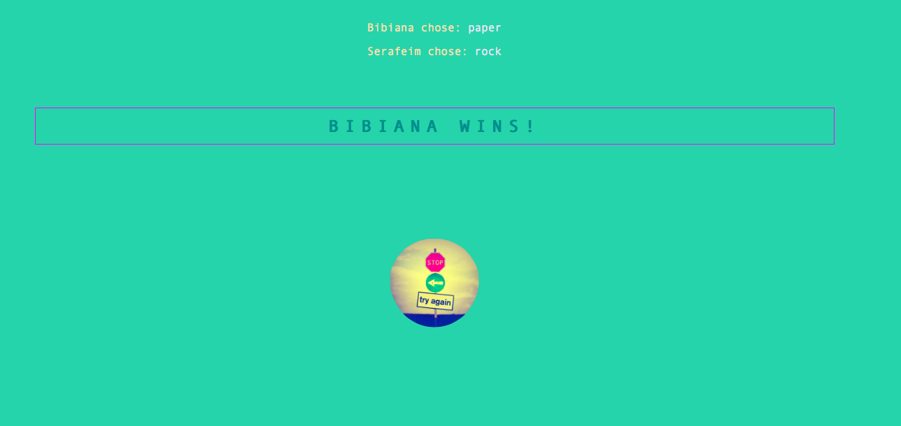

## Challenge: Rōnin Badge Test

## Screenshot

  

  

  

  

  

# Task
Provide a Rock, Paper, Scissors game for the Makers Academy Marketing Array ( MAMA ) so they can play on the web with the following features:

the marketeer has to enter their name before the game
the marketeer will be presented the choices (rock, paper and scissors)
the marketeer can choose one option
the game will choose a random option
a winner will be declared
As always you can use google your notes and everything else. This is a challenge for you and you only!

Rōnin BANZAI!!!!

### Bonus: Multiplayer

Change the game so that two marketeers can play against each other ( yes there are two of them ).

#### Basic Rules

Rock beats Scissors
Scissors beats Paper
Paper beats Rock

## Context

Week 3 challenge at Makers Academy

## Resources

- Bundle
- Capybara
- Cucumber
- GitHub
- IRB
- Rackup
- Rspec
- Ruby
- Sinatra
- Shotgun

## Installation

1. Before downloading:
  - Install [Ruby](https://www.ruby-lang.org/en/documentation/installation/)

2. Download the code:
  - `$ git clone https://github.com/BibianaC/ronin_badge_test`

3. Install the gems:
  - `$ bundle install`

4. Start the server
  - `$ rackup`

5. Open your browser
  - http://localhost:9292/

## Contributors

- Bibiana Cristòfol